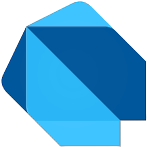

<p align="center">
  
</p>

<h1 align="center">🚀 DART MASTERCLASS</h1>

<p align="center">
  <strong>Portal Pembelajaran Dart Interaktif - Dari Dasar hingga Mahir</strong>
</p>

<p align="center">
  
  
  
  
</p>

---

## 📖 Deskripsi

**Dart Masterclass** adalah portal pembelajaran berbasis web yang dirancang untuk membantu Anda menguasai bahasa pemrograman Dart secara komprehensif. Dengan desain modern, animasi interaktif, dan materi yang terstruktur, pembelajaran menjadi lebih menyenangkan dan efektif.

### ✨ Fitur Utama

| Fitur | Deskripsi |
|-------|-----------|
| 🎨 **Desain Premium** | Antarmuka modern dengan efek glassmorphism dan animasi dinamis |
| 🌐 **Fully Responsive** | Tampilan optimal di desktop, tablet, dan mobile |
| ✨ **Animasi 3D** | Efek tilt dan parallax pada kartu materi |
| 🎯 **9 Bab Lengkap** | Materi terstruktur dari dasar hingga advanced |
| 💡 **Mini Projects** | Latihan praktis di setiap bab |
| 📝 **Tugas Rumah** | Penugasan untuk menguji pemahaman |

---

## 📚 Daftar Materi

Portal ini terdiri dari **9 bab** yang disusun secara bertahap:

### 🎯 Bab 1: Pengenalan & Sejarah
- Apa itu Dart?
- Sejarah dan perkembangan Dart
- Keunggulan Dart dibandingkan bahasa lain
- Setup environment

### 📦 Bab 2: Variabel & Tipe Data
- Variabel dan konstanta
- Tipe data primitif (int, double, String, bool)
- Type inference dengan `var`
- Dynamic type

### 🏗️ Bab 3: Struktur Program
- Struktur dasar program Dart
- Comments (single-line, multi-line, documentation)
- Library dan import
- Top-level functions

### ➕ Bab 4: Operator Dart
- Operator aritmatika
- Operator perbandingan
- Operator logika
- Operator assignment
- Operator bitwise

### 🔄 Bab 5: Control Flow
- If-else statements
- Switch-case
- For loops
- While dan do-while loops
- Break dan continue

### 🏠 Bab 6: Functions Dasar
- Deklarasi function
- Parameter (positional, named, optional)
- Return values
- Main function

### 🎯 Bab 7: Advanced Functions
- Short expression (arrow function)
- Inner function
- Function sebagai first-class citizen
- Callback functions

### 🛡️ Bab 8: Null Safety & Ternary
- Konsep null
- Null safety di Dart
- Nullable types (`?`)
- Null-aware operators (`??`, `?.`, `!`)
- Ternary operator

### ⚡ Bab 9: Higher Order Functions
- Anonymous function / Lambda
- Higher Order Function
- Scope dan Lexical Scope
- Closures

---

## 🛠️ Teknologi yang Digunakan

<table>
  <tr>
    <td align="center">
      <br>
      <strong>HTML5</strong><br>Struktur
    </td>
    <td align="center">
      <br>
      <strong>CSS3</strong><br>Styling
    </td>
    <td align="center">
      <br>
      <strong>JavaScript</strong><br>Interaktivitas
    </td>
  </tr>
</table>

### 🎨 Fitur Desain

- **CSS Variables** - Sistem warna dan tema yang konsisten
- **Glassmorphism** - Efek kaca buram modern
- **CSS Grid & Flexbox** - Layout responsif
- **CSS Animations** - Animasi halus dan dinamis
- **Google Fonts (Poppins)** - Tipografi premium

### ⚡ Fitur Interaktif

- **3D Tilt Effect** - Kartu bereaksi terhadap gerakan mouse
- **Parallax Background** - Efek kedalaman pada background
- **Intersection Observer** - Animasi scroll yang halus
- **Typing Effect** - Animasi ketik pada subtitle
- **Dynamic Glow** - Efek cahaya mengikuti cursor

---

## 📁 Struktur Proyek

```
Dart/
├── 📄 index.html          # Halaman utama portal
├── 🎨 styles.css          # Stylesheet utama
├── 📜 script.js           # JavaScript interaktif
├── 🖼️ Dart1.png           # Logo Dart
├── 📖 README.md           # Dokumentasi proyek
│
├── 📂 Bab 1 dart/         # Pengenalan & Sejarah
│   ├── index.html
│   ├── style.css
│   └── script.js
│
├── 📂 Bab 2 dart/         # Variabel & Tipe Data
│   ├── index.html
│   ├── style.css
│   └── script.js
│
├── 📂 Bab 3 dart/         # Struktur Program
│   ├── index.html
│   ├── style.css
│   └── script.js
│
├── 📂 Bab 4 dart/         # Operator Dart
│   ├── index.html
│   ├── style.css
│   ├── script.js
│   └── slides-data.js
│
├── 📂 Bab 5 dart/         # Control Flow
│   ├── index.html
│   ├── style.css
│   ├── script.js
│   └── slides-data.js
│
├── 📂 Bab 6 dart/         # Functions Dasar
│   ├── index.html
│   ├── style.css
│   └── script.js
│
├── 📂 Bab 7 dart/         # Advanced Functions
│   ├── index.html
│   ├── style.css
│   └── script.js
│
├── 📂 Bab 8 dart/         # Null Safety & Ternary
│   ├── index.html
│   ├── style.css
│   ├── script.js
│   └── slides-data.js
│
└── 📂 Bab 9 dart/         # Higher Order Functions
    ├── index.html
    ├── style.css
    ├── script.js
    └── slides-data.js
```

---

## 🚀 Cara Penggunaan

### Prasyarat

Tidak ada instalasi yang diperlukan! Proyek ini adalah aplikasi web statis yang dapat dijalankan langsung di browser.

### Menjalankan Proyek

1. **Clone Repository**
   ```bash
   git clone https://github.com/username/dart-masterclass.git
   cd dart-masterclass
   ```

2. **Buka di Browser**
   
   **Opsi 1:** Klik dua kali pada file `index.html`
   
   **Opsi 2:** Gunakan Live Server (VS Code Extension)
   ```
   Klik kanan pada index.html → "Open with Live Server"
   ```
   
   **Opsi 3:** Gunakan Python HTTP Server
   ```bash
   # Python 3
   python -m http.server 8000
   
   # Buka browser ke http://localhost:8000
   ```

3. **Navigasi Materi**
   - Klik pada kartu bab untuk masuk ke materi
   - Gunakan tombol navigasi untuk berpindah slide
   - Selesaikan mini project dan tugas rumah

---

## 🎨 Skema Warna

Portal menggunakan tema dark mode dengan palet warna berikut:

| Variable | Hex | Preview | Kegunaan |
|----------|-----|---------|----------|
| `--primary` | `#00B4DB` |  | Warna utama |
| `--accent` | `#00f2fe` |  | Aksen cyan |
| `--accent-pink` | `#ff006e` |  | Aksen pink |
| `--accent-purple` | `#8338ec` |  | Aksen ungu |
| `--bg-dark` | `#030014` |  | Background |
| `--text-main` | `#e0e6ed` |  | Teks utama |

---

## 📱 Responsivitas

Portal dirancang untuk tampil optimal di berbagai ukuran layar:

| Ukuran Layar | Grid Layout | Keterangan |
|--------------|-------------|------------|
| 🖥️ Desktop (>1024px) | 3 kolom | Tampilan penuh |
| 💻 Tablet (768-1024px) | 2 kolom | Menyesuaikan |
| 📱 Mobile (<768px) | 1 kolom | Tampilan mobile |

---

## 📝 Catatan Pengembangan

### Performa
- Menggunakan CSS `transform` untuk animasi (hardware-accelerated)
- Intersection Observer untuk lazy-loading animasi
- Optimasi gambar dengan ukuran yang tepat

### Aksesibilitas
- Semantik HTML5 yang tepat
- Kontras warna yang memadai
- Navigasi keyboard-friendly

### Browser Support
- ✅ Chrome (versi terbaru)
- ✅ Firefox (versi terbaru)
- ✅ Safari (versi terbaru)
- ✅ Edge (versi terbaru)

---

## 📄 Lisensi

Proyek ini dilisensikan di bawah **MIT License** - lihat file [LICENSE](LICENSE) untuk detail.

---

## 👨‍💻 Kontributor

<table>
  <tr>
    <td align="center">
      <strong>Developer</strong><br>
      Dibuat dengan ❤️ untuk pembelajaran Dart
    </td>
  </tr>
</table>

---

## 🙏 Ucapan Terima Kasih

- [Dart Team](https://dart.dev/) - Untuk bahasa pemrograman Dart yang luar biasa
- [Google Fonts](https://fonts.google.com/) - Untuk font Poppins
- [Shields.io](https://shields.io/) - Untuk badges

---

<p align="center">
  <strong>⭐ Jika proyek ini bermanfaat, jangan lupa berikan bintang! ⭐</strong>
</p>

<p align="center">
  Made with 💙 | © 2026 Dart Learning Journey
</p>
